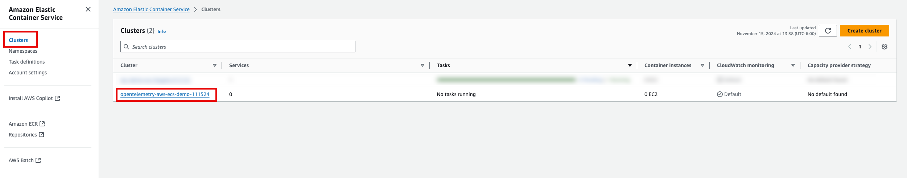

id: dt-opentelemetry-aws-ecs

summary: dynatrace opentelemetry ingest for aws ecs (fargate) using opentelemetry collector as sidecar container

author: Tony Pope-Cruz

# OpenTelemetry for AWS ECS
<!-- ------------------------ -->
## Overview 
Total Duration: 30 minutes

### What You’ll Learn Today
In this lab we'll utilize the OpenTelemetry Collector deployed as a sidecar container to collect traces and metrics from a Node.js app on AWS ECS (Fargate) and ship them to Dynatrace.

Lab tasks:
1. Create an AWS Elastic Container Service (ECS) Cluster
2. Create an AWS IAM Policy
3. Create an AWS IAM Role (x2)
4. Create an AWS SSM Parameter (x3)
5. Create an AWS ECS Task Definition
6. Create an AWS ECS Service on the Cluster
7. Observe the results in Dynatrace


<!-- -------------------------->
## Technical Specification 
Duration: 2

#### Technologies Used
- [Dynatrace](https://www.dynatrace.com/trial)
- [Amazon AWS Elastic Container Service](https://aws.amazon.com/ecs/)
  - tested on Platform Version 1.4.0
- [Node.js](https://nodejs.org/en/download/package-manager)
  - tested on v20.17.0
- [OpenTelemetry Collector - AWS Distro](https://aws-otel.github.io/docs/setup/ecs)
  - tested on v0.41.1

#### Reference Architecture


#### Prerequisites
- Admin access to AWS Account with permissions to deploy resources in AWS ECS, IAM, and SSM Parameter Store
- Dynatrace SaaS tenant
- Dynatrace Access (API) Token with the following scopes
  - Ingest metrics
  - Ingest OpenTelemetry traces

<!-- -------------------------->
## Setup
Duration: 18

### Setting up AWS Distro for OpenTelemetry Collector in Amazon Elastic Container Service
This guide generally follows setup instructions from AWS here:
[AWS Distro for OpenTelemetry Collector in ECS](https://aws-otel.github.io/docs/setup/ecs)

### Create ECS Fargate Cluster

Open the AWS Console in your browser.  Navigate to the Elastic Container Service (ECS) page.  Click on Clusters.  Click on Create Cluster.


Set the Cluster name.  Select AWS Fargate (Serverless) as the cluster Infrastructure type.


Disable Container Insights under the Monitoring section.  Click Create.


### Create IAM Policy
https://aws-otel.github.io/docs/setup/ecs/create-iam-policy

Open the AWS Console in your browser.  Navigate to Identity Access Management (IAM) page.  Click on Policies.  Click on Create Policy.


Choose JSON.  Paste the following snippet into the JSON Policy Editor field:
```json
{
    "Version": "2012-10-17",
    "Statement": [
        {
            "Effect": "Allow",
            "Action": [
                "logs:PutLogEvents",
                "logs:CreateLogGroup",
                "logs:CreateLogStream",
                "logs:DescribeLogStreams",
                "logs:DescribeLogGroups",
                "logs:PutRetentionPolicy",
                "xray:PutTraceSegments",
                "xray:PutTelemetryRecords",
                "xray:GetSamplingRules",
                "xray:GetSamplingTargets",
                "xray:GetSamplingStatisticSummaries",
                "cloudwatch:PutMetricData",
                "ec2:DescribeVolumes",
                "ec2:DescribeTags",
                "ssm:GetParameters"
            ],
            "Resource": "*"
        }
    ]
}
```

Click Next.


Give the policy a name, i.e. `ECS_AWSDistroOpenTelemetryPolicy`.  Click Create Policy.

```text
ECS_AWSDistroOpenTelemetryPolicy
```


### Create IAM Roles
https://aws-otel.github.io/docs/setup/ecs/create-iam-role

Open the AWS Console in your browser.  Navigate to Identity Access Management (IAM) page.  Click on Roles.  Click on Create Role.


Select Trusted Entity Type `AWS Service`.  Select Service or use case `Elastic Container Service`.  Choose `Elastic Container Service Task`.  Click Next.


Search for the custom Policy created in the previous step.  Check the box to apply the Policy.  Click Next.


Give the role a name, i.e. `ECS_AWSOTTaskRole`.  Click Create Role.

```text
ECS_AWSOTTaskRole
```


Create a second Role.  Click on Create Role.


Select Trusted Entity Type `AWS Service`.  Select Service or use case `Elastic Container Service`.  Choose `Elastic Container Service Task`.  Click Next.


Search for and Select the `AmazonECSTaskExecutionRolePolicy` Policy.


Search for and Select the `CloudWatchLogsFullAccess` Policy.


Search for and Select the `AmazonSSMReadOnlyAccess` Policy.  Click Next.


Give the role a name, i.e. `ECS_AWSOTTaskExcutionRole`.  Click Create Role.

```text
ECS_AWSOTTaskExcutionRole
```


### Create SSM Parameters
https://aws-otel.github.io/docs/setup/ecs/config-through-ssm

The AWS Distro for OpenTelemetry Collector can optionally be configured via an environment variable AOT_CONFIG_CONTENT. The value of this variable is expected to be a full Collector configuration file; it will override the config file used in the Collector entrypoint command. In ECS, the values of environment variables can be set from AWS Systems Manager Parameters.

Open the AWS Console in your browser.  Navigate to System Manager page.  Click on Parameter Store.  Click on Create Parameter.


Give the parameter a name, i.e. `/opentelemetry/collector/aws-otel-collector-dynatrace`.

```text
/opentelemetry/collector/aws-otel-collector-dynatrace
```

Choose type `String`.  Optionally you can use type `SecureString` if you have AWS KMS set up.

In the `Value` field, paste in the contents of [OpenTelemetry Collector Config](opentelemetry/collector/config.yaml) from this repo.  Note that there is a `4096` character limit, remove extra characters, comments, and unnecessary configurations if needed.

Click Create Parameter and then create another parameter.


Give the parameter a name, i.e. `/dynatrace/opentelemetry-aws-ecs/dt_otlp_endpoint`.

```text
/dynatrace/opentelemetry-aws-ecs/dt_otlp_endpoint
```

Choose type `String`.  Optionally you can use type `SecureString` if you have AWS KMS set up.

In the `Value` field, provide the base endpoint URL for the Dynatrace OTLP API.

```text
https://environment-id.live.dynatrace.com/api/v2/otlp
```

Click Create Parameter and then create another parameter.


Give the parameter a name, i.e. `/dynatrace/opentelemetry-aws-ecs/dt_api_token`.

```text
/dynatrace/opentelemetry-aws-ecs/dt_api_token
```

Choose type `String`.  Optionally you can use type `SecureString` if you have AWS KMS set up.

In the `Value` field, provide the Dynatrace API Access Token value with `openTelemetryTrace.ingest`, `metrics.ingest` token scopes.

```text
dt0c01.*
```

Click Create Parameter.


### Create ECS Task Definition
https://aws-otel.github.io/docs/setup/ecs/create-task-definition-console

Open the AWS Console in your browser.  Navigate to the Elastic Container Service (ECS) page.  Click on Task Definitions.  Click Create New Task Definition.


Enter a family name, i.e. `opentelemetry-aws-ecs-demo`.

```text
opentelemetry-aws-ecs-demo
```


Set the Launch Type to `AWS Fargate`.  Set the Task Role and Task Execution Role to the custom Roles created earlier.


Configure container 1, the application container.  Set the container name to `rolldice`, the image to `popecruzdt/rolldice:1.0.0`, and set essential container to `Yes`.

Set the container port to `80`, protocol to `TCP`, port name to `rolldice-80-http`, and app protocol to `HTTP`.


Set the container environment variables:

| Name                               | Value                                      |
|------------------------------------|--------------------------------------------|
| OTEL_SERVICE_NAME                  | rolldice                                   |
| OTEL_EXPORTER_OTLP_PROTOCOL        | grpc                                       |
| OTEL_RESOURCE_ATTRIBUTES           | service.namespace=opentelemetry-aws-ecs-demo|
| OTEL_EXPORTER_OTLP_ENDPOINT        | http://localhost:4317                      |
| OTEL_EXPORTER_OTLP_TRACES_ENDPOINT | http://localhost:4317                      |
| OTEL_TRACES_EXPORTER               | otlp                                       |


Click on Add Container to add a second, sidecar container.


Configure container 2, the OpenTelemetry Collector container.  Set the container name to `otel-collector`, the image to `amazon/aws-otel-collector`, and set essential container to `No`.  If this container fails, the task will continue to run.

Set the container port to `4317`, protocol to `TCP`, port name to `otel-collector-4317-http`, and app protocol to `gRPC`.

Add another container port, set the port to `4318`, protocol to `TCP`, port name to `otel-collector-4318-http`, and app protocol to `HTTP`.


Set the container environment variables:

| Name                               | Value                                      |
|------------------------------------|--------------------------------------------|
| OTEL_SERVICE_NAME                  | rolldice                                   |
| OTEL_RESOURCE_ATTRIBUTES           | service.namespace=opentelemetry-aws-ecs-demo|


Disable trace collection and metric collection from ECS native monitoring capabilities.  Click Create.


### Create ECS Service

Open the AWS Console in your browser.  Navigate to the Elastic Container Service (ECS) page.  Click on Clusters.  Click on the Cluster you created earlier.



From the Services tab, click on Create to create a new Service


Select `Launch type` for the Compute Options.  For Launch Type, choose `FARGATE`.


Select `Service` for Application Type.  Select your recently created Family and the latest Revision.  Give the Service a name, using the family name with a `-service` suffix.


In the Networking section, create a Security Group.  Choose `Create a new security group` and allow HTTP traffic on port 80 from Anywhere.  If security is an issue/concern, restrict the source IP address range as needed.  Set Public IP to `Turned On`.


Leave the remaining settings alone.  Click on Create.


Wait for the recently created Service to finish deploying.  The Service should switch to the `Running` state.  Click on the Service to view the details.


From the Task tab, click on the running Task.


In the Configuration section, locate the Public IP field.  Click on `open address`.  It will open your browser to the service on port 80 at the `/` location.  You will get an HTTP 404 error, this is fine.


Change the URI in the address bar to `/rolldice`.  This will invoke the service and should respond with a random number between 1 and 6.


### Add OpenTelemetry Metric Allowed Attributes in Dynatrace
https://docs.dynatrace.com/docs/ingest-from/opentelemetry/getting-started/metrics/configuration 

Open the Dynatrace UI in your browser.  Navigate to the Settings page.  Navigate to the `Settings > Metrics > OpenTelemetry metrics` section.  In the section `Allow list: resource and scope attributes` you can configure which resource and scope attributes to add as dimensions to ingested OTLP metrics.


Add the following attributes to the allow list:

https://github.com/open-telemetry/opentelemetry-collector-contrib/tree/main/receiver/awsecscontainermetricsreceiver#resource-attributes-and-metrics-labels

```text
aws.ecs.cluster.name
```

```text
aws.ecs.service.name
```

```text
aws.ecs.task.family
```

```text
aws.ecs.task.id
```

```text
cloud.account.id
```

```text
cloud.region
```

```text
cloud.resource_id
```

```text
container.id
```

```text
container.name
```

```text
dynatrace.otel.collector
```


### Observe Results in Dynatrace

Import the `AWS ECS OpenTelemetry` Dashboard into your Dynatrace environment.

[AWS ECS OpenTelemetry Dashboard](assets/dt_dashboard_AWS_ECS_OpenTelemetry.json)


Open the Services and Distributed Traces Apps to analyze the `rolldice` transactions.

<!-- -------------------------->
## Wrap Up

### What You Learned Today 
By completing this lab, you've successfully deployed the OpenTelemetry Collector as a sidecar container on AWS ECS (Fargate) to collect traces and logs then ship them to Dynatrace for analysis.
- The OpenTelemetry Collector was deployed as a sidecar container within the ECS Task Definition
  - The collector configuration was stored in SSM Parameter Store and loaded through an environment variable
  - The Dynatrace API details were stored in SSM Parameter Store and loaded through an environment variable
- Dynatrace Dashboards (via DQL) allows you to perform powerful queries and analysis of the trace and metric data

<!-- ------------------------ -->
### Supplemental Material
N/A